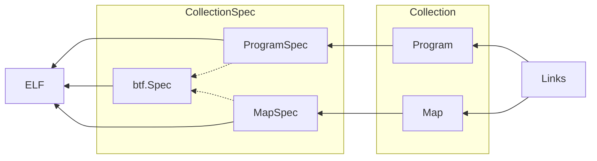

# BPF-XDP 

eBPF (extended Berkeley Packet Filter) XDP (Express Data Path) programs are a type of eBPF program that are attached to a network interface using the XDP hook. The XDP hook is a low-level hook that allows eBPF programs to be executed early in the packet receive path, before the packet is passed up the network stack.

XDP programs can be used to perform various packet processing tasks, such as filtering, forwarding, modifying, or collecting statistics on network traffic. Because they execute in the kernel, they have access to low-level network metadata and can be used to implement advanced networking features that would otherwise require kernel modifications.

The XDP hook (eXpress Data Path) is a hook in the Linux kernel that allows for packet processing at the earliest possible stage in the networking stack. It provides a low-level interface to packet filtering and manipulation, and is often used for high-performance network processing.

XDP programs are written in C and compiled into eBPF bytecode using the LLVM compiler. The eBPF bytecode is then loaded into the kernel using the bpf system call. Once loaded, the XDP program can be attached to a network interface.

___
___

## Cilium ebpf

Cilium is an open-source project that provides a networking and security solution for containerized applications that leverages eBPF technology. The __Cilium eBPF library__ provides a Go interface to the eBPF subsystem, making it easier to write eBPF programs in Go.

The Cilium eBPF library is a Go library that provides abstractions over eBPF programs and maps, as well as helpers for loading and attaching eBPF programs to various hooks in the Linux kernel.

[Cilium ebpf](https://github.com/cilium/ebpf)

[Documentation](https://pkg.go.dev/github.com/cilium/ebpf)

### Architecture of library

[Refer for architecture](https://github.com/cilium/ebpf/blob/master/ARCHITECTURE.md)


___
___

## XDP hook

 The __XDP hook (eXpress Data Path)__ is a hook in the Linux kernel that allows for packet processing at the earliest possible stage in the networking stack. It provides a low-level interface to packet filtering and manipulation, and is often used for high-performance network processing.
 The XDP hook is one of the hooks that Cilium provides an abstraction for.
___
___

## Cilium ebpf project structure

<!-- Code Blocks -->
```
$tree xdp
xdp
|----bpf_bpfeb.go
|----bpf_bpfeb.o
|----bpf_bpfel.go
|----bpf_bpfel.o
|----main.go
|____xdp.c    

0 directories,6 files
```
The ebpf program's source code file,__xdp.c__ in the diagram, is compiled using __bpf2go__, a code generation tool provided by cilium/ebpf. 
bpf2go uses the clang compiler to generate two ebpf bytecode files: "bpf_bpfeb.o" for big-endian and "bpf_bpfel.o" for little-endian systems. Additionally, bpf2go generates "bpf_bpfeb.go" or "bpf_bpfel.go" files based on the corresponding bytecode file. 
These go source files contain the ebpf program's bytecode as binary data.

The "main.go" file is responsible for the user state of the ebpf program. Compiling "main.go" with either "bpf_bpfeb.go" or "bpf_bpfel.go" creates the final ebpf program.


[Read more about bpf2go](https://github.com/cilium/ebpf/tree/master/cmd/bpf2go)


