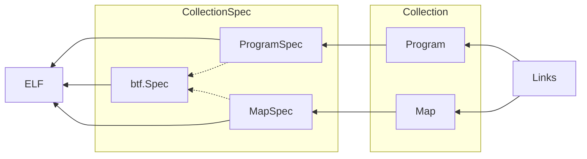

# BPF-XDP 

eBPF (extended Berkeley Packet Filter) XDP (Express Data Path) programs are a type of eBPF program that are attached to a network interface using the XDP hook. The XDP hook is a low-level hook that allows eBPF programs to be executed early in the packet receive path, before the packet is passed up the network stack.

XDP programs can be used to perform various packet processing tasks, such as filtering, forwarding, modifying, or collecting statistics on network traffic. Because they execute in the kernel, they have access to low-level network metadata and can be used to implement advanced networking features that would otherwise require kernel modifications.

The XDP hook (eXpress Data Path) is a hook in the Linux kernel that allows for packet processing at the earliest possible stage in the networking stack. It provides a low-level interface to packet filtering and manipulation, and is often used for high-performance network processing.

XDP programs are written in C and compiled into eBPF bytecode using the LLVM compiler. The eBPF bytecode is then loaded into the kernel using the bpf system call. Once loaded, the XDP program can be attached to a network interface.

## Cilium ebpf

Cilium is an open-source project that provides a networking and security solution for containerized applications that leverages eBPF technology. The __Cilium eBPF library__ provides a Go interface to the eBPF subsystem, making it easier to write eBPF programs in Go.

The Cilium eBPF library is a Go library that provides abstractions over eBPF programs and maps, as well as helpers for loading and attaching eBPF programs to various hooks in the Linux kernel.

[Cilium ebpf](https://github.com/cilium/ebpf)

[Documentation](https://pkg.go.dev/github.com/cilium/ebpf)

### Architecture of library

[Refer for architecture](https://github.com/cilium/ebpf/blob/master/ARCHITECTURE.md)



## XDP hook

 The __XDP hook (eXpress Data Path)__ is a hook in the Linux kernel that allows for packet processing at the earliest possible stage in the networking stack. It provides a low-level interface to packet filtering and manipulation, and is often used for high-performance network processing.
 The XDP hook is one of the hooks that Cilium provides an abstraction for.

## Cilium ebpf project structure

<!-- Code Blocks -->
```
$tree xdp
xdp
|----bpf_bpfeb.go
|----bpf_bpfeb.o
|----bpf_bpfel.go
|----bpf_bpfel.o
|----main.go
|____xdp.c    

0 directories,6 files
```
The ebpf program's source code file,__xdp.c__ in the diagram, is compiled using __bpf2go__, a code generation tool provided by cilium/ebpf. 
bpf2go uses the clang compiler to generate two ebpf bytecode files: "bpf_bpfeb.o" for big-endian and "bpf_bpfel.o" for little-endian systems. Additionally, bpf2go generates "bpf_bpfeb.go" or "bpf_bpfel.go" files based on the corresponding bytecode file. 
These go source files contain the ebpf program's bytecode as binary data.

The "main.go" file is responsible for the user state of the ebpf program. Compiling "main.go" with either "bpf_bpfeb.go" or "bpf_bpfel.go" creates the final ebpf program.


[Read more about bpf2go](https://github.com/cilium/ebpf/tree/master/cmd/bpf2go)

## Userspace program written in __Go__ using Cilium ebpf library 

Major components you might find in this userspace eBPF program written using the Cilium eBPF library in Go are as follows:

1. **Loading** pre-compiled eBPF programs into the kernel
1. **Attaching** the eBPF program to a network interface using XDP (eXpress Data Path)
1. **Printing** the contents of the BPF hash map (source IP address -> packet count) to stdout every second using a ticker.
1. A helper function formatMapContents() to **format the contents** of the BPF hash map as a string.
1. **Error handling** for all potential errors, such as failing to load the eBPF program or failing to attach it to the network interface.

```Go

package main

import (
	"fmt"
	"log"
	"net"
	"os"
	"strings"
	"time"

	"github.com/cilium/ebpf"
	"github.com/cilium/ebpf/link"
)

```
Import statements for required Go packages and the Cilium eBPF library and link package.


```Go

// $BPF_CLANG and $BPF_CFLAGS are set by the Makefile.
//go:generate go run github.com/cilium/ebpf/cmd/bpf2go -cc $BPF_CLANG -cflags $BPF_CFLAGS bpf xdp.c -- -I../headers

```
This part of the code generates Go code that includes the compiled eBPF program as an embedded byte array, which is then used in the main Go program without relying on external files.
The comment indicates following line is a __Go generate directive__, genertaes Go code that includes the compiled eBPF program, defined in the C source file xdp.c, as an embedded byte array.
The __$BPF_CLANG__ and __$BPF_CFLAGS__ environment variables are used as parameters for the command, and they are expected to be set by the Makefile. These environment variables specify the C compiler and its flags to use when compiling the eBPF program.

```Go
func main() {
	if len(os.Args) < 2 {
		log.Fatalf("Please specify a network interface")
	}

	// Look up the network interface by name.
	ifaceName := os.Args[1]
	iface, err := net.InterfaceByName(ifaceName)
	if err != nil {
		log.Fatalf("lookup network iface %q: %s", ifaceName, err)
	}
```
We check that the user has provided a command-line argument specifying the network interface to attach the XDP program to. If not, the program exits with a fatal error message.
We use the network interface name specified by the user to look up the corresponding interface object using the `net.InterfaceByName()` function. If the lookup fails, the program exits with a fatal error message.

```Go
	// Load pre-compiled programs into the kernel.
	objs := bpfObjects{}
	if err := loadBpfObjects(&objs, nil); err != nil {
		log.Fatalf("loading objects: %s", err)
	}
	defer objs.Close()
```
This creates an empty `bpfObjects` struct and then loads pre-compiled eBPF programs into the kernel using the `loadBpfObjects()` function. If the load fails, the program exits with a fatal error message. If the load succeeds, a defer statement is used to ensure that the `Close()` method of the `bpfObjects` struct is called at the end of the function, regardless of whether it returns normally or with an error.


